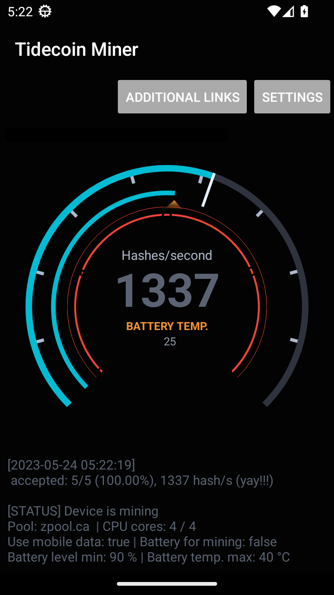

# Mining App

> From a battery temperature of more than 50°C there is a risk of irreversible damage of battery.  So please be careful with this setting.

## Mining with opened app
The hash rate will be highest possible if the screen is unlocked and mining app is opened. The display is not locked automatically as long as the app stays opened.

To ensure the app has the rights, please check the following.
- Long press on the app icon. Select "App Info". "Battery usage" -> "Allow foreground activity".
- Optional also select: "Privacy Permissions (Allow Auto Start)", otherwise you have to restart manually, if app gets stopped

## Mining in background
With the set settings, the device will start mining automatically even if the display is locked. For example, mining is automatically activated at night when the device is charged.

To increase mining performance when device is locked, please check the following.
- Long press on the app icon. Select "App Info". "Battery usage" -> "Allow all background activity". (A warning will appear that the battery consumption will increase. That's correct. The app will only start mining when the specified properties are met.)
- Select: "Privacy Permissions (Allow Auto Start)"

> It is possible for Android to stop the background process every now and then, for example when resources are needed. Then the Tidecoin entry in the status bar disappears. It is enough to open the app once again to force a restart.

## Screens of application

## Main View

## Additional Links

## Settings

